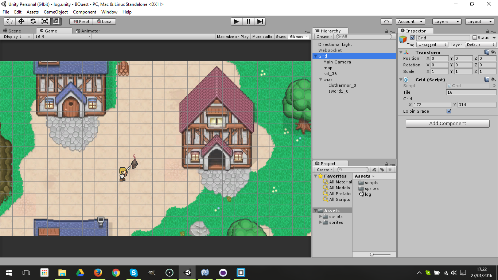

# BQuest

Testando um projeto da Unity no github...

## Tutoriais
 * [How to prepare a Unity project for git?](http://stackoverflow.com/questions/21573405/how-to-prepare-a-unity-project-for-git)
 * [How to use Git for Unity source Control?](http://stackoverflow.com/questions/18225126/how-to-use-git-for-unity-source-control)
